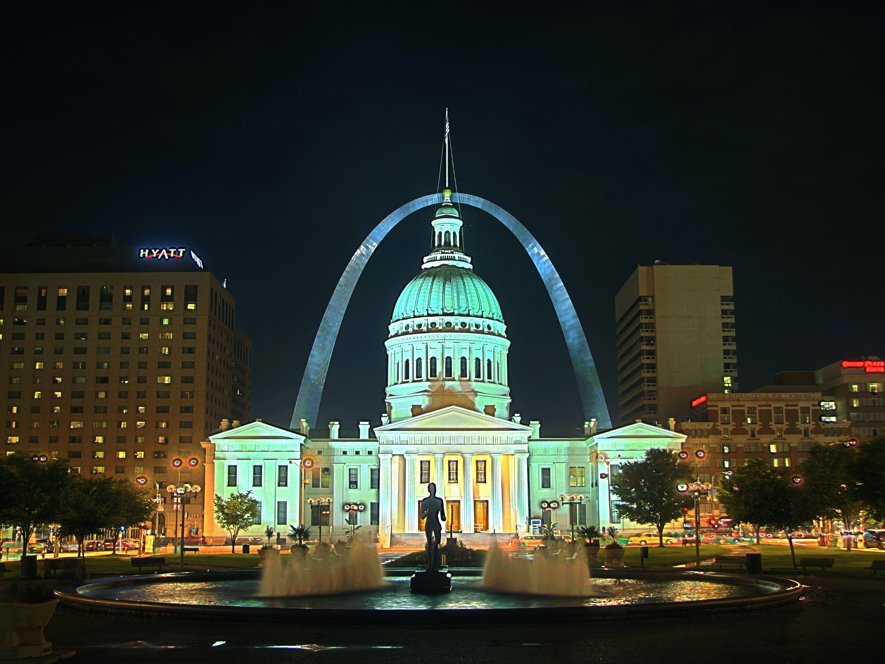

# hdr-rust

**hdr-rust** is a package written in **Rust**. It provides different methods of
HDR construction and tone-mapping.  



## Build

This project is written in rust. To build this project, please install **rust** first.  
To install **rust**, please follow this [instruction](https://www.rust-lang.org/tools/install) first.  

Then building this project with **Cargo**.  
```
cargo build
```

To run this project, please use the following command:  

```
cargo run
```

## Log

**hdr-rust** uses **pretty_env_logger** to manage runtime log
information. To enable logs when running this tool, please use 
the following command:  

```
RUST_LOG=trace cargo run
``` 
